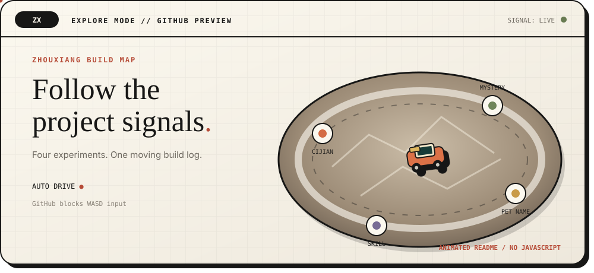

<p align="center">
  <a href="#explore-mode">
    
  </a>
</p>

<p align="center">
  <sub>AI applications, interactive prototypes, practical tools, and writing.</sub>
</p>

## 👋 I turn AI ideas into things people can use

I'm **zhouxiang**, an AI builder exploring applications, interactive prototypes, and practical tools.

I like moving from a rough idea to a working experience: defining the interaction, connecting the model, testing the edge cases, and shipping something others can try.

`DISCOVER` the real problem　·　`PROTOTYPE` the interaction　·　`TEST` the boundaries　·　`SHIP` the experience

📕 [Xiaohongshu](https://xhslink.cn/o/4z8FhQexdYj) · ✉️ [Email](mailto:3525043496@qq.com) · 🧑‍💻 [All repositories](https://github.com/1545468557?tab=repositories)

---

<a id="explore-mode"></a>

## 🎮 Explore Mode



<sub>This animated build map runs directly inside the GitHub README. GitHub blocks JavaScript and keyboard input, so it is a visual game preview rather than a WASD-controlled game.</sub>

---

<a id="selected-projects"></a>

## ⭐ Selected projects

| Project | What it explores | Stack |
| --- | --- | --- |
| 💬 [**Cijian · Our Shared Space**](https://github.com/1545468557/cijian-demo) | Shared memories and AI-assisted message handoff for long-distance couples | `React` `TypeScript` `Cloudflare D1` |
| 🔎 [**Did You Ask the Right Question?**](https://github.com/1545468557/kanshan-game) | A 3D investigation scene with clues and open-ended AI character conversations | `Three.js` `Node.js` `LLM` |
| 🐾 [**Pet Name Studio**](https://github.com/1545468557/pet-name-studio) | Browse, shortlist, and generate personalized pet names with AI | `JavaScript` `Express` `SQLite` |
| 🧩 [**Product Deconstruction Skill**](https://github.com/1545468557/product-deconstruction-skill) | Evidence-backed product analysis from screenshots, URLs, or source code | `Agent Skill` `HTML` `Python` |

## ✍️ Writing

I write about AI, technology, law, and the people inside the story.

- [她跟豆包说想妈妈的时候，我突然笑不出来了](https://mp.weixin.qq.com/s/u_uym0fEDTvVJF29kDgqqg) — 2026.09.07
- [GPT-6来了，人类离AGI还有多远](https://mp.weixin.qq.com/s/wl7piJDJ9ZBM-XjLAU3sHg) — 2026.09.05
- [OpenAI投出的法律AI独角兽，为什么用Kimi K3训练首个自研模型](https://mp.weixin.qq.com/s/3lpWQUWYw6fDQbfDCTPysg) — 2026.08.30
- [为什么孙宇晨起诉景甜，还把她的父母一起告了](https://mp.weixin.qq.com/s/yXESopnKi79J49g__6yfgw) — 2026.08.30

## 🎯 What I focus on

- **Interactive experiences** — turning abstract ideas into hands-on web and 3D prototypes.
- **Useful AI behavior** — designing memory, context, role boundaries, and graceful fallbacks around real tasks.
- **End-to-end delivery** — connecting product thinking, interface design, implementation, and testing.
- **Reusable methods** — packaging what works into tools, skills, and clear reports.

## 🔬 Current build loop

```text
observe → define → prototype → test → refine → ship
```

<p align="center">
  <code>BUILD SMALL · LEARN FAST · MAKE IT USEFUL</code>
</p>
