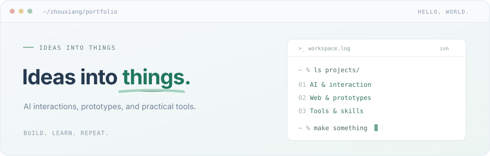

<p align="center">
  <a href="https://portfolio-1545468557.reyes-iurepux.chatgpt.site">
    
  </a>
</p>

<p align="center">
  <sub>Click the signal board to enter my interactive portfolio and 3D build map.</sub>
</p>

## 👋 I turn AI ideas into things people can use

I'm **zhouxiang**, an AI builder exploring applications, interactive prototypes, and practical tools.

I like moving from a rough idea to a working experience: defining the interaction, connecting the model, testing the edge cases, and shipping something others can try.

`DISCOVER` the real problem　·　`PROTOTYPE` the interaction　·　`TEST` the boundaries　·　`SHIP` the experience

🌐 [Interactive portfolio](https://portfolio-1545468557.reyes-iurepux.chatgpt.site) · 📕 [Xiaohongshu](https://xhslink.cn/o/4z8FhQexdYj) · ✉️ [Email](mailto:3525043496@qq.com) · 🧑‍💻 [All repositories](https://github.com/1545468557?tab=repositories)

---

<a id="selected-projects"></a>

## ⭐ Selected projects

| Project | What it explores | Stack |
| --- | --- | --- |
| 💬 [**Cijian · Our Shared Space**](https://github.com/1545468557/cijian-demo) | Shared memories and AI-assisted message handoff for long-distance couples | `React` `TypeScript` `Cloudflare D1` |
| 🔎 [**Did You Ask the Right Question?**](https://github.com/1545468557/kanshan-game) | A 3D investigation scene with clues and open-ended AI character conversations | `Three.js` `Node.js` `LLM` |
| 🐾 [**Pet Name Studio**](https://github.com/1545468557/pet-name-studio) | Browse, shortlist, and generate personalized pet names with AI | `JavaScript` `Express` `SQLite` |
| 🧩 [**Product Deconstruction Skill**](https://github.com/1545468557/product-deconstruction-skill) | Evidence-backed product analysis from screenshots, URLs, or source code | `Agent Skill` `HTML` `Python` |

## 🎯 What I focus on

- **Interactive experiences** — turning abstract ideas into hands-on web and 3D prototypes.
- **Useful AI behavior** — designing memory, context, role boundaries, and graceful fallbacks around real tasks.
- **End-to-end delivery** — connecting product thinking, interface design, implementation, and testing.
- **Reusable methods** — packaging what works into tools, skills, and clear reports.

## 🔬 Current build loop

```text
observe → define → prototype → test → refine → ship
```

<p align="center">
  <code>BUILD SMALL · LEARN FAST · MAKE IT USEFUL</code>
</p>
